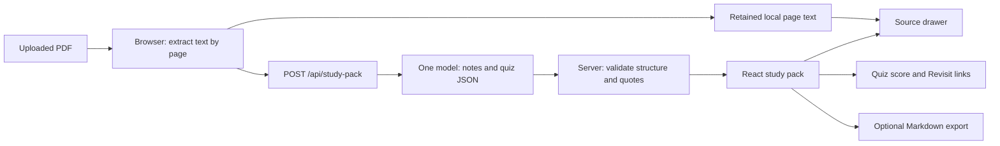

# StudyForge — implementation plan for a 2.5-hour build

**Product:** one lecture PDF → revision notes + five practice questions → source inspection and targeted rereading.

**Budget:** 150 minutes, confirmed by the user. This is a build allocation, not a verified wall-clock deadline. Team size, hosting access, API credentials, official demo duration, and submission rules remain unknown. Plan for one implementer without depending on parallel staffing.

**Repository reality:** two planning documents and an incomplete `index.html` referencing missing `style.css` and `app.js`. There is no React scaffold, package manifest, functioning API integration, or verified running app. Preserve the existing files when scaffolding; do not treat their markup as completed functionality.

## 1. Review verdict

The original idea fits the brief. Its main weakness is that separate notes, quiz, and badge surfaces can look like a generic PDF summarizer. Connect the student's mistake, revision note, and source in one visible interaction.

| Earlier plan | Refinement | Benefit |
| --- | --- | --- |
| Notes and quiz as separate outputs | Shared concept IDs and Revisit links. | A coherent study loop. |
| Whole-document substring check | Exact quote matched on its cited PDF page, with context. | Inspectable source location. |
| “Verified” suggests factual correctness | “Passage located” with an honest explanation. | A defensible technical claim. |
| Browser API key and two providers | One server route and one working provider. | Fewer integration points and no key in the UI. |
| History and dark mode early | Current-pack shell first; history later; one finished light theme. | More time for the core screens. |
| Quiz JSON export | One readable Markdown study pack. | Better student-facing output. |

**Stop condition:** a fresh supported PDF produces a valid pack, all five questions can be completed, source passages can be inspected, and missed concepts open the correct notes. Verify that path in the intended runtime before optional work.

## 2. Scope and performance targets

**P0:** text PDF upload; real generation; three to five note sections; exactly five questions; citations on every note bullet and question; source drawer; accurate score and Revisit actions; polished core states; server-held key and bounded requests.

**P1, in order:** Markdown export → subject style → recent-pack persistence → original PDF page preview. Export and personalisation are intended bonuses, not reasons to leave P0 incomplete.

**Cuts:** OCR, additional file formats, multiple files, chat, flashcards, mind maps, calendars, accounts, cloud database, vector store, retrieval framework, second provider, adaptive quiz generation, dark mode, and animation libraries.

Use a meaningful 4–8 page demo PDF. Aim for generation within 20 seconds and upload-to-pack within 30 seconds. These are targets to measure, not established claims. Use a shorter genuine lecture or a faster available model if needed; keep honest progress and timeout handling.

## 3. Architecture

Retain **React + Vite + JavaScript + handwritten CSS**. Add `pdfjs-dist` for browser extraction and a small **Node/Express** server with one generation route. Use the selected provider's official SDK. Claude remains the default from the original plan; confirm working credentials and a structured-output model at the first checkpoint. If unavailable, select one accessible provider before integration rather than adding a provider toggle.



| Responsibility | Owner |
| --- | --- |
| Read PDF bytes and retain physical page numbers | Browser with PDF.js worker. |
| Send extracted text and subject style | React → our API. |
| Hold key, select model, enforce input/output limits | Server. |
| Write note and question content | One model call on the ordinary path. |
| Validate structure and locate quotes | Shared pure helpers; authoritative validation on server. |
| Show evidence, score, navigate, export | Browser; no additional model call. |
| Optional recent packs | Capped localStorage, without raw PDF bytes or keys. |

In development, Vite proxies `/api` to Node. For the demo deployment, Node serves both `dist/` and `/api/study-pack` on one origin. A static `dist/` upload alone does not deploy the API. Confirm hosting supports this; use localhost only if event rules allow it.

Store `ANTHROPIC_API_KEY` and `LLM_MODEL` in server-only environment variables, with placeholders in `.env.example`. A provider key must never have a `VITE_` prefix: Vite exposes those values in client code. [Vite environment documentation](https://vite.dev/guide/env-and-mode)

## 4. PDF extraction and supported inputs

Initial prototype limits: **one PDF, 10 MB, 30 pages, 60,000 extracted characters**. These are conservative application limits, not provider maximums. Enforce page/character limits and bounded JSON body size again on the server.

1. Check file size/signature, then parse with PDF.js. Handle corrupt and password-protected documents explicitly.
2. Read each page using `getPage(pageNumber)` and `getTextContent()`. Bundle the worker from the same installed PDF.js version.
3. Join text runs using spacing and end-of-line information. Preserve page boundaries. Apply Unicode NFC and whitespace normalization; preserve case, numbers, punctuation, mathematical symbols, and negations.
4. Retain `{ pageNumber, text }` for each physical page, starting at 1. This canonical text is both sent to the model and used for matching and display.
5. Reject limits instead of silently truncating. Below roughly 200 readable characters overall, say **“We could not extract enough text. Try a text-based lecture PDF.”** This is an extraction heuristic, not proof of a scan.
6. Before generation, list pages without usable text and let the student continue with the readable pages or choose another document. Record omitted page numbers in the pack/export. If the remaining text cannot support five useful questions, return an insufficient-content state.

The prototype interprets extracted text, not diagrams or images. Columns, tables, formulas, and slide layouts may extract poorly. Even a page containing text can have an unread diagram; do not claim complete visual understanding or full document coverage.

The optional original-page preview uses PDF.js canvas rendering. Core highlighting stays in the extracted text drawer, avoiding text-layer coordinate mapping. [PDF.js examples](https://mozilla.github.io/pdf.js/examples/) and [PDF.js API reference](https://mozilla.github.io/pdf.js/api/draft/module-pdfjsLib.html)

## 5. AI generation contract

The browser sends the page map and constrained subject style to `/api/study-pack`. The server owns a fixed instruction and treats document text as source data, including any instructions embedded inside the PDF. No tool calls or external retrieval are needed.

Prompt requirements:

- Use supplied lecture content only; return `insufficient_content` when five distinct useful questions are not supportable.
- Select three to five concepts with stable IDs. Give each a heading and two or three concise bullets; target roughly 250–450 words of notes overall.
- Each bullet expresses one claim or tightly related idea, with an exact contiguous supporting quote and physical PDF page number.
- Generate exactly five questions, each referencing a concept ID, covering every selected concept at least once.
- Prefer two recall, two understanding, and one simple application question when the source supports that mix. Source support and clarity take priority over the mix.
- Each question has four distinct options, exactly one correct index, a short explanation of the relevant distinction, and a supporting passage for its correct answer. No trick ambiguity or “all of the above.”
- Application scenarios may be explicitly hypothetical, but the tested rule must appear in the cited passage. Do not require outside knowledge.
- Quotes should normally be 8–40 words copied from one page; no stitched fragments or inserted ellipses. Vary correct-answer positions.
- Do not return confidence, verification booleans, quote offsets, or mastery scores. Application code owns checks and measurements.
- Subject style changes emphasis only: STEM definitions/formulas, Humanities arguments/evidence, Language vocabulary/grammar, General balanced notes. Never invent content to satisfy a style.

Use provider-supported structured JSON output. Current Claude documentation uses `output_config.format` with a JSON schema; application validation is still necessary for unsupported constraints, refusals, and truncated responses. A “strict JSON” prompt plus code-fence stripping is insufficient as the sole contract. [Claude structured outputs](https://platform.claude.com/docs/en/build-with-claude/structured-outputs)

### Content shape

```text
ModelResult
  status: "ok" | "insufficient_content"
  reason: string                    // empty on success
  title: string                     // empty on insufficient content
  concepts: Concept[]               // 3–5 on success; empty otherwise
  quiz: Question[]                  // exactly 5 on success; empty otherwise

Concept
  id: string
  title: string
  bullets: NoteBullet[]             // 2–3

NoteBullet
  text: string
  citation: Citation

Question
  id: string
  conceptId: string                 // must resolve to an existing concept
  kind: "recall" | "understanding" | "application"
  question: string
  options: string[]                 // exactly 4 distinct values
  correctIndex: integer             // 0–3
  explanation: string
  citation: Citation

Citation
  pageNumber: integer               // physical PDF page, starting at 1
  quote: string                     // exact contiguous passage
```

For `insufficient_content`, show the short reason as plain text and retain the selected file; do not apply success cardinality checks to its empty arrays.

The application adds pack ID, schema version, filename, source hash, creation time, subject style, page count, omitted pages, retained page text, measured generation duration, and calculated citation matches. Physical PDF page numbers may differ from printed slide/page labels; consistently say **PDF p. n**.

## 6. Validation and evidence: the central technical contribution

First handle provider errors, refusal, truncation, and JSON parsing. Validate required fields and string bounds, unique IDs, three to five concepts, two or three bullets per concept, exactly five questions, four nonempty distinct options, and integer answer indices from 0 to 3. Every concept reference must resolve, every concept must be tested, and every citation must reference an included page.

Then check each citation:

1. Normalize the proposed quote with the same NFC/whitespace rules as the page text.
2. Search only its declared page using exact, case-sensitive substring matching.
3. Reject empty or generic quotes; use at least eight words for this text-lecture prototype rather than accepting a common word as evidence.
4. On success, derive `matchStart`/`matchEnd` in the canonical page text. The source drawer highlights that slice using `<mark>` and displays surrounding text from the retained page.
5. On failure, record `not_found` or `invalid_page` for repair feedback. Validation details say **Source not located**; only successful matches say **Passage located · PDF p. n**.

Do not fuzzy-match another sentence, silently correct a page number, accept model-generated offsets, or turn a failed candidate into a completed pack. Conservative matching may reject a valid quote because of extraction quirks; that is a known limitation.

Allow **at most one additional model call per generation attempt** for a repairable structure or source-check failure. Send the same source with specific errors and regenerate the small complete object. Count this against all request budgets. Do not automatically retry authentication errors, rate limits, or timeouts.

If validation still fails, preserve the file and show **“We couldn't create a complete source-linked pack. Please retry or use another lecture.”** Never fabricate missing questions or silently downgrade to fewer than five.

**Scope of the claim:** these checks establish structure, valid links, and quote presence. They do not prove a note follows logically from its quote or that an answer key is correct. Manually review the demo pack for those content problems. The source drawer makes human inspection straightforward.

## 7. Quiz logic and UI state

Keep generated content separate from the attempt:

```text
Attempt
  answersByQuestionId: { [questionId]: selectedIndex }
  submittedQuestionIds: string[]
  currentQuestionIndex: integer
  completedAt: timestamp | null
```

Score submitted answers by index comparison. Find the concept IDs for wrong answers and deduplicate them. A Revisit action selects Notes, scrolls/focuses that concept section, and opens the missed question's source citation. This uses existing data and makes no AI call. Retry resets only the attempt and is labelled repeated practice.

One shell with local React state is sufficient; no router is required:

```text
empty → file_selected → extracting → generating → validating → ready
                       ↘ error      ↘ error      ↘ error

ready: Notes ↔ Practice → Results → Revisit → Notes
```

| Surface | Behavior |
| --- | --- |
| Upload | One dropzone, filename/size, Create study pack, Try a sample lecture. The sample runs the real pipeline. |
| Processing | Real stage transitions/page counts; duplicate submit disabled. Request IDs stop late responses replacing a newer pack. Cancel stale work where possible. |
| Notes | A readable sheet of concept sections with per-bullet source chips. Show measured metadata, not invented time saved or complete coverage claims. |
| Practice | One question; keyboard-accessible options; Submit answer; feedback/source after submission; Next. Lock submitted answers. Hide notes/evidence while the next question is unanswered. |
| Results | `x/5 this attempt` after five submissions, missed concepts, Revisit actions, Retry practice. No mastery percentage. |
| Source drawer | Filename, physical page number, highlighted extracted passage and context. Escape closes; focus returns to trigger. Mobile uses a full-width sheet. |
| Error | Explain the failed step and one relevant recovery. Keep the selected file and preserve an earlier valid pack until replacement succeeds. |

Browser cancellation may not cancel provider billing; request limits remain server-enforced.

## 8. Visual system

Keep an Apple-inspired level of restraint with a distinct paper-and-highlight study surface.

| Token | Value / use |
| --- | --- |
| Canvas / paper | `#F5F5F2` / `#FFFFFF`. |
| Main / secondary text | `#202124` / `#62666D`. |
| Action | `#2458D3`, buttons and active links. |
| Source highlight | `#FFF1B8` with dark text. |
| Border | `#E1E3E6`, thin dividers; not text. |
| Type | System sans; 30–34px title, 20px section title, 16px body, 13px metadata. |
| Spacing | 4 / 8 / 12 / 16 / 24 / 32 / 48px. |
| Layout | Approximately 208px sidebar, 680–760px reading column, 340–400px source drawer when space allows. |
| Shape / motion | 12px controls/panels, restrained overlay shadow, 150–200ms transitions, reduced-motion support. |

At 1366×768, keep the title, next action, and useful content visible. Collapse the sidebar and overlay the drawer before the reading column becomes cramped. Check 390px width, contrast, keyboard focus, and content overflow in the actual browser.

Avoid nested cards, decorative charts, giant empty headers, fake activity, or settings-heavy onboarding. The screenshot worth polishing is a note/question beside its highlighted evidence.

## 9. Optional export and persistence

**Markdown export first:** construct one document with title, filename, extraction limitations, notes and page references, five questions, then a clearly separated answer key with explanations and quoted evidence. Download via a browser Blob. No extra model call, export service, or PDF-generation library. Page references stay readable but are not promised as working PDF deep links.

**Subject selector next:** keep `general` as the internal default even without UI. The selector changes one constrained field in the same generation request.

**Recent packs third:** save at successful generation and after each submitted answer, not only after quiz completion. Retain at most five packs and cap serialized data around 2 MB. Store canonical page text for evidence after reload; never raw PDF bytes or API keys. Revalidate the stored schema and recompute source matches before reopening without generation.

Catch storage/quota failures and continue in memory with **“This pack is available for this session only.”** Provide Delete pack/Clear recent packs. Label persistence **Saved on this browser**.

Raw PDF bytes remain in memory. If original-page preview is added, reopening an older pack still supports extracted evidence but requests the PDF again for its visual preview; verify the source hash before associating the file. Cut the preview before building persistent binary storage.

## 10. Server boundary and failure handling

The API accepts bounded page text and constrained metadata. It is not a generic prompt relay: server code owns the model, prompt, schema, token budget, and provider destination. Render source/model strings as escaped text, without generated HTML or arbitrary fetched URLs.

For the controlled single-instance demo, enforce per-IP request limits, bounded concurrency, body size, and a total provider-call cap that includes repairs. Start with three generation attempts per IP per minute and 40 provider calls per process. Configure client-IP handling for the chosen host. These counters reset on restart and are not a durable public quota; record the shortcut. Use an enforceable provider spending cap if available, and do not expand to unbounded public traffic under this configuration.

Start with a 30-second timeout per provider call and roughly a 65-second route ceiling for a possible repair; confirm the host permits it. Keep routine logs to request IDs, sizes, timings, and safe error categories, without keys or lecture contents.

Upload copy must explain that extracted lecture text is sent to the AI service. Browser extraction does not make the entire workflow offline or on-device.

| Failure | Recovery |
| --- | --- |
| Too large/long, unsupported, corrupt, or password-protected PDF | Name the problem and request a suitable replacement. |
| Too little readable/study material | Explain the extraction/content limitation and retain file selection. |
| Missing/invalid API configuration | Service unavailable in the UI; diagnosis server-side. |
| Timeout or rate limit | Clear failure with manual retry; no indefinite spinner or automatic loop. |
| Bad structure or missing source | One bounded regeneration, then an explicit failure. |
| Storage unavailable | Keep the working pack in memory and offer export if implemented. |
| Provider outage in the demo | Explicitly switch to a labelled saved example only if event rules permit it. |

## 11. Intended files

```text
package.json, vite.config.js, index.html
.env.example, .gitignore
server/index.js                  # API, limits, provider call, serves dist
shared/studyPack.js               # contract, normalization, validation, matching
src/main.jsx
src/App.jsx                      # shell, active pack, async state
src/components/UploadPanel.jsx
src/components/StudyPack.jsx      # notes and view selection
src/components/QuizPlayer.jsx     # attempt and results
src/components/SourceDrawer.jsx
src/lib/pdf.js                   # extraction, optional page rendering
src/lib/api.js                   # request, cancellation, safe errors
src/lib/export.js                # optional Markdown download
src/lib/storage.js               # optional capped recent packs
src/styles.css
public/sample-lecture.pdf        # team-authored, meaningful 4–8 page input
tests/studyPack.test.js          # focused validation/evidence checks
README.md                        # setup, demo steps, limits, submission links
```

Document shortcuts briefly in README or `POST_HACKATHON.md` during implementation: text-only extraction, unproven semantic correctness, local history, resettable quotas, and any labelled cached fallback. Avoid a large planning-document suite during the build.

## 12. The 150-minute sequence

Minutes run from implementation start. If planning consumes the same 2.5-hour window, subtract time already spent and shorten optional work first. Reserve final verification time.

| Time | Build slice | Observable checkpoint |
| --- | --- | --- |
| 0–15 min | React/Node scaffold, credentials/model, thin live call, runnable host choice. | Browser calls our API; real structured output returns; key stays server-side. |
| 15–35 min | PDF extraction, limits, page map, sample lecture, processing states. | Two text PDFs produce inspectable pages; unsupported input fails clearly. |
| 35–65 min | Prompt, schema, quote matching, bounded repair, pack state. | Real upload yields three to five concepts, five questions, and located citations. |
| 65–105 min | Finished study surface, source drawer, quiz, score, Revisit links. | Entire P0 path works with real output, including the mistake-to-source interaction. |
| 105–120 min | Markdown export first, subject selector next. History/preview only with demonstrated slack. | Download is readable; every exposed optional control works. |
| 120–140 min | Feature freeze; build/deployment, error checks, desktop/mobile inspection. | Fresh input works in the intended runtime; focused checks pass. |
| 140–150 min | Timed rehearsal, evidence/fallback capture, README and required submission items. | Demo is ready and actual event deliverables are checked. |

Checkpoints override optional work:

- **15 minutes:** if no real provider call works, resolve access immediately; drop history and preview. Do not polish an unconnected shell.
- **65 minutes:** if valid packs do not generate, fix the smallest core blocker. Fixtures can help build UI but do not pass this gate.
- **105 minutes:** if P0 is incomplete, spend the bonus window integrating it. Cut preview, history, subject selector, then export if necessary. Preserve the source drawer and Revisit interaction.
- **120 minutes:** stop new features. Fix the demo and complete actual submission requirements. Move this freeze earlier if video/upload requirements need more time.

A saved-only demo cannot substitute for a missing live core or mandatory fresh-input requirement.

## 13. Verification and demo readiness

Use focused automated tests for the central deterministic claims, with the available runner or Node's built-in runner. Avoid tests that simply repeat CSS implementation details.

| Check | Required result |
| --- | --- |
| Quote with line-break/space differences | Matches after documented normalization. |
| Real quote on the wrong page | Fails; no cross-page green badge. |
| Changed negation, number, symbol, or case | Fails exact matching. |
| Empty/generic quote or nonexistent page | Fails validation. |
| Four questions, duplicate IDs/options, bad answer index, broken concept reference | Rejected instead of partial success. |
| Known five-answer sequence | Exact score and deduplicated missed concepts. |
| Failed quote check and failed repair | At most two provider calls and a recoverable error. |

Run the actual app through the following checks:

1. Upload the sample PDF, observe real progress, and review all notes/questions. Manually verify answer keys, ambiguity, and whether each passage supports its associated claim.
2. Open a note citation; confirm the drawer uses retained page text, highlights the actual match, and identifies the physical PDF page.
3. Submit a wrong answer, inspect its source, finish the quiz, and use Revisit. Confirm correct note focus and preserved score.
4. Generate from a second, previously ungenerated supported PDF through the same path. This guards against sample-only behavior.
5. Exercise an image-only PDF and a forced API failure. Confirm recovery without fake completion.
6. If implemented, read the Markdown export, reload a saved pack without a model request, and test unavailable storage.
7. Inspect at 1366×768 and 390px, plus keyboard and reduced-motion behavior. Use available browser tools or manual inspection; do not assume a particular connector exists.
8. Build and serve the production app with its API in the intended runtime. Check browser requests/bundle for key exposure and test generation outside the Vite dev server.
9. Rehearse the 90-second story in [IDEA.md](IDEA.md), measure latency, and capture a successful run. Label saved/precomputed fallbacks and check event rules before using them.

Record observed performance and input limitations. Do not invent time saved, adoption, accuracy rates, or mastery improvements. Keep the final screenshot on the notes/source view, where the value is visible.

## 14. Completion boundary

This is a plan, not evidence of an implemented app. The prototype is complete only after P0 works with real generation in the intended runtime, the central checks and failure paths are exercised, and required event deliverables are handled. Optional features may be claimed only after their controls and output are verified; otherwise remove them from the demo.
